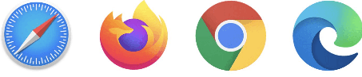
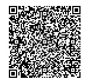
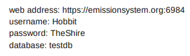

# Getting Started with eMission

### What you will need:

* A Device
  * Smart phone (iPhone or Android for example) or Tablet
  * Laptop (Mac, Windows, Chromebook) or computer
* A web browser
  * Chrome, Firefox, Safari, Edge, Opera,...

* Name, password and link from your mission leader. This will be an email or letter with either:
  * QR code 
  * or text credentials
* Internet access (for the first time)
  * The link will load all the information automatically into your browser

### It's free

There is no program or app to install. No license to agree to. No fee.

### It's easy

Internet access is only needed intermittently and data usage is relatively low.
