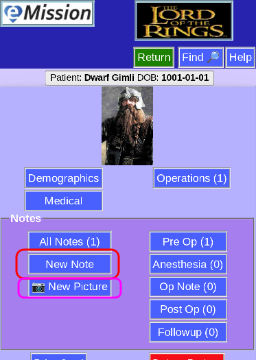

# New Note

## Starting a new note

There are 2 ways to create a new note or photo:

From the **Patient Menu**

or from the **Note List**

## Adding content

Once started, all the fields of the note can be added including 

* text

* images

Press **Save** to add the note

