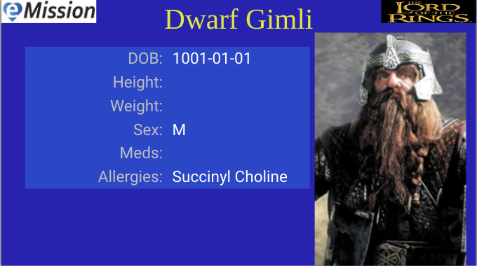

# Patient

eMission is centered around patients. Their problems, operations, and progress.

Specifically, for each patient there is

* Medical and personal information
* A photograph for identification
* Operation records
* Notes of various types
  * General
  * PreOp
  * Anesthesia
  * OpNote
  * PostOp
  * Followup
