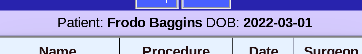

# Patient Bar

Just under the Header is the Patient Bar

* Shows the current selected patient
  * Useful when viewing notes and operations
  * Includes date-of-birth for more accurate identification
* Patient name is actually a button that can take you to this patient's menu page
* Mission name will be shown when looking at mission notes